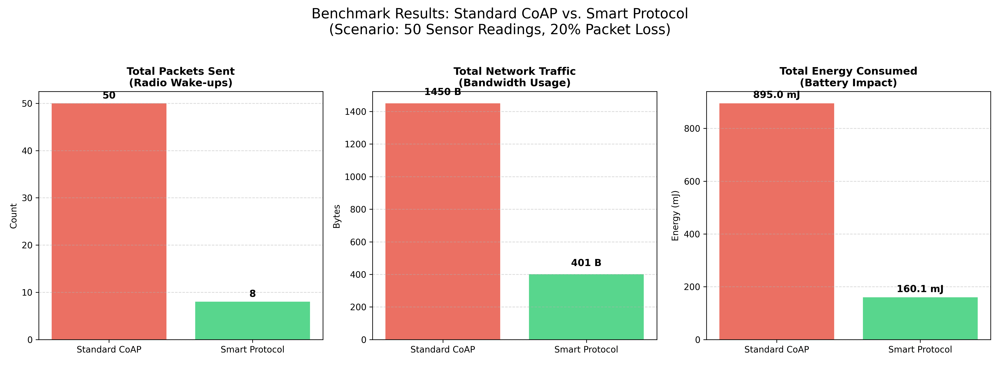

# Energy-Aware Transport Protocol (Research PoC)

  

## Abstract

This project implements a Proof-of-Concept (PoC) for a novel **Energy-Efficient Transport Protocol** designed for battery-constrained IoT devices.

Standard protocols like UDP and CoAP impose significant overhead ("Header Tax") and provide no reliability guarantees, while TCP is too heavy for duty-cycled radios. This research proposes a **context-aware transport layer** that dynamically aggregates packets and adapts both transmission behavior and reliability guarantees (ARQ) based on the device's remaining energy budget.

## Research Goals

1.  **Reduce Protocol Overhead:** Minimize the ratio of header bytes to payload bytes via packet aggregation.
2.  **Optimize Radio Duty Cycle:** Reduce energy-expensive radio state transitions (Sleep to Wake) by buffering data.
3.  **Adaptive Reliability:** Implement an energy-aware Automatic Repeat Request (ARQ) mechanism that stops retrying when the battery is critical.
4.  **Extend Network Lifetime:** Introduce "Graceful Degradation" where nodes sacrifice latency and reliability for longevity.

## Protocol Specification

The protocol operates over UDP but implements a custom lightweight header to facilitate energy awareness.

### Header Structure (6 Bytes)

Unlike standard TCP (20+ bytes) or CoAP (4+ bytes + Options), this header is stripped down to the bare minimum required for sequenced, state-aware delivery.

```text
  0                   1                   2                   3
  0 1 2 3 4 5 6 7 8 9 0 1 2 3 4 5 6 7 8 9 0 1 2 3 4 5 6 7 8 9 0 1
 +-+-+-+-+-+-+-+-+-+-+-+-+-+-+-+-+-+-+-+-+-+-+-+-+-+-+-+-+-+-+-+-+
 |                        Sequence Number (32)                   |
 +-+-+-+-+-+-+-+-+-+-+-+-+-+-+-+-+-+-+-+-+-+-+-+-+-+-+-+-+-+-+-+-+
 |   Flags (8)   |   Budget (8)  |      Payload (Variable) ...
 +-+-+-+-+-+-+-+-+-+-+-+-+-+-+-+-+

```

* **Sequence Number (4 bytes):** Used for ordering and matching ACKs to requests.
* **Flags (1 byte):** Bitmask for protocol state.
* `0x01`: Aggregated Payload.
* `0x02`: ACK Packet.


* **Budget (1 byte):** A value from `0-255` representing the device's energy status (mapped from 0-100% battery).
* **Payload:** Contains one or multiple sensor readings separated by a delimiter.

## Adaptive Logic (The Core Innovation)

The core innovation of this protocol is the **Energy-Aware State Machine**. The sender monitors its own battery state and adjusts the aggregation threshold and reliability policy dynamically.

| Battery Level | Operational Mode | Aggregation Threshold | Reliability Policy |
| --- | --- | --- | --- |
| **> 70%** | Real-Time | 1 item (Immediate) | **High (3 Retries)** |
| **30% - 70%** | Balanced | 5 items | **Medium (1 Retry)** |
| **< 30%** | Survival | 10 items | **None (0 Retries)** |

*In "Survival Mode", the device deliberately sacrifices data freshness and reliability to minimize radio wake-up events.*

## Network Chaos Simulation

To validate the reliability logic, `utils.py` includes a **Packet Loss Simulator**.
By default, there is a **20% chance** that any transmitted packet is "dropped" (ignored) by the code to simulate a poor wireless environment. This forces the Sender to demonstrate its Retry/Timeout logic visible in the console logs.

## Getting Started

### Prerequisites

* Python 3.10+
* `aiocoap` (for the competitor benchmark)
* `matplotlib` (optional, for graphing)

```bash
pip install aiocoap matplotlib

```

### Installation

Clone the repository:

```bash
git clone [https://gitlab.com/yourname/iot-protocol.git](https://gitlab.com/yourname/iot-protocol.git)
cd iot-protocol

```

### Running the Simulation

The project is configured as a Head-to-Head benchmark. Run the `main.py` entry point to start the Smart Protocol vs. Standard CoAP comparison.

```bash
python main.py

```

The simulation will:

1. Run the **Smart Protocol** (Sender + Receiver) under simulated network chaos.
2. Run the **Standard CoAP** (Client + Server) for comparison.
3. Output a final **Efficiency Gain** calculation to the console.

## Methodology & Metrics

To evaluate the efficacy of this protocol, the system compares the protocol against a standard UDP/CoAP baseline using:

1. **Network Efficiency:** (Useful Payload Bytes) / (Total Bytes on Wire including Retries).
2. **Energy Estimate:** Calculated based on the number of TX events (First attempts + Retries) and radio wake-up costs ( mJ).
3. **Reliability Cost:** The energy "penalty" paid to guarantee delivery in high-battery modes.

## Visual Results

The graph below illustrates the massive reduction in both radio wake-ups (packets) and bandwidth usage achieved by the Smart Protocol compared to standard CoAP.




## Project Structure

* **`main.py`**: The experiment orchestrator. Comparison logic resides here.
* **`sender.py`**: Implements the Adaptive Logic, Buffering, and Stop-and-Wait ARQ.
* **`receiver.py`**: The custom protocol server.
* **`coap_competitor.py`**: The industry standard baseline implementation.
* **`utils.py`**: Shared constants and Network Loss Simulator.
* **`plot_results.py`**: Helper script to generate the graph above.
* **`results/`**: Directory for generated logs and graphs.
